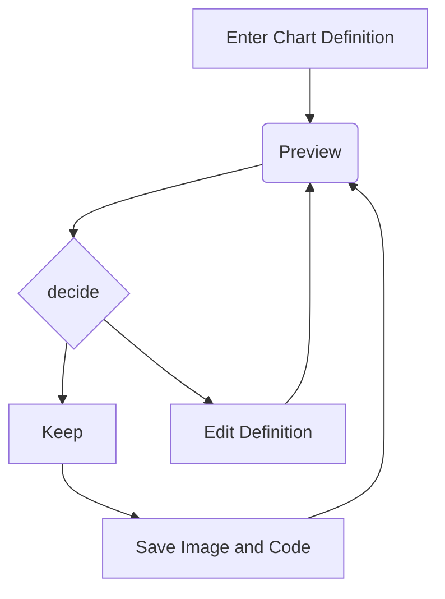

# 목적 : markdown의 extension인 mermaid 작성 학습

``` mermaid
graph TD;
    A-->B;
    A-->C;
    B-->D;
    C-->D;
```

```mermaid
graph TD
    A[Enter Chart Definition] --> B(Preview);
    B --> C{decide};
    C --> D[Keep];
    C --> E[Edit Definition];
    E --> B;
    D --> F[Save Image and Code];
    F --> B;
```